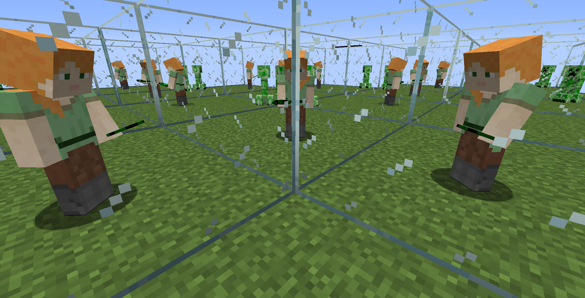
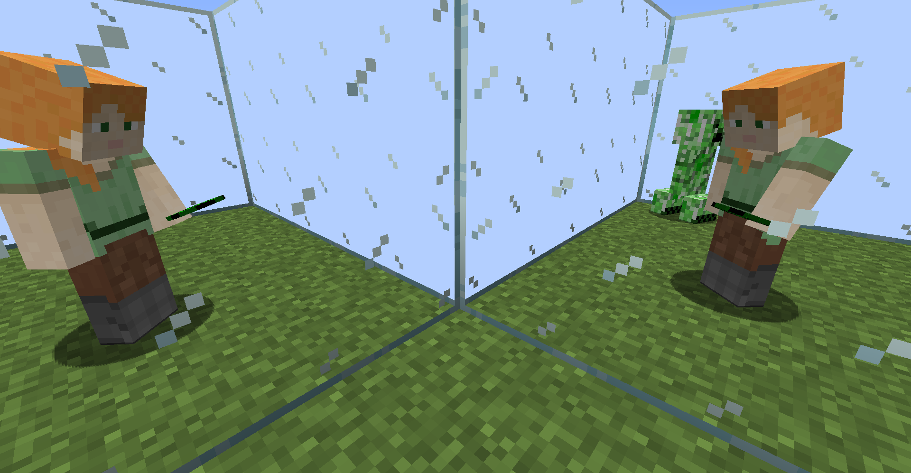
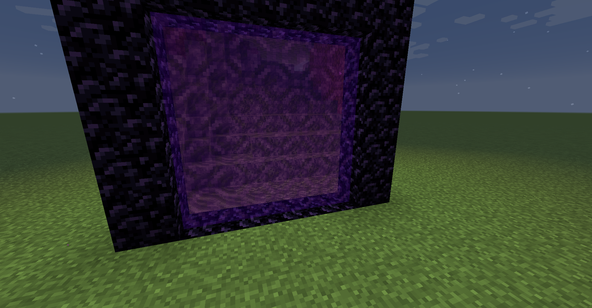

## Client-Side Performance Configurations
When you are nearby a portal, the FPS may drop due to these reasons:
* Portal rendering. If the portal is invisible in the view (for example hidden by a wall) then it won't be rendered. Rendering a portal is roughly equivalent to rendering the whole world inside the portal again.
* Client lighting updates. Some remote light updates happen upon chunk data retrieval and some light updates happen upon portal rendering. The light updates may cause lag spikes.
* More chunk mesh rebuild. This mod tries not to build any remote chunk in the render thread during portal rendering. But rebuilding the chunks that are viewed through portals sometimes still costs performance.
* More frequent GC due to loading more chunks. Approaching a portal loads more chunks and entities which consumes more RAM and may increase GC frequency thus creating more lag spikes.

### Max Portal Layer
Specifies the maximum portal-in-portal rendering layer.

When rendering infinite mirror room or world wrapping portals, the FPS may go very low because it renders too many portals in portals.

Turning down the max portal layer can save your FPS.

If it's 0, you can see the portal view area but the world inside the portal won't be rendered.

### Lag Attack Proof
When FPS drops because of rendering too many portals, it will enter "lag attack proof" mode and only render one layer of portals and only render near portals which helps you recover from the lag. If that's enabled then you will not be lag-attacked by a mirror room.

### Reduced Portal Rendering
If enabled, fewer chunks will be rendered inside the portal thus increase the FPS. And the faraway portals won't be rendered.

### Portal Render Limit
The maximum amount of portals that can be rendered in one frame.

## Server-Side Performance Configurations

If a player is close to a portal, then the chunks on the other side will be loaded and ticked.
The chunks near the player are directly loaded.
The chunks that are only visible through the portal are remotely (indirectly) loaded chunks.
The chunk loading radius of a portal is determined by the player's distance to the portal.
|Player distance to portal|Portal chunk loading radius|
|-|-|
|0 ~ 5|`serverLoadingDistance`|
|5 ~ 15|`(serverLoadingDistance * 2) / 3`|
|15 ~ 48|`serverLoadingDistance / 3`|
|> 48|`0`|

Global portals are different. The global portal's loading distance is `serverLoadingDistance - (playerDistanceToPortal / 16)`

Reducing the extra chunks loaded can increase server performance.

### Actively Load Remote Chunks

If this is turned off, remote chunks will not be ticked.
Redstone and entities will not move in remote chunks.
Turning this off increases server performance.
(If this is disabled, nether portal linking may not work normally.)

### Indirect Loading Radius Cap
Defines the maximum loading radius of indirect chunk loading through portals. Turning it down means that fewer chunks will be loaded when a player approaches a portal thus increase server performance.

## Other Client-Side Configurations
### Compatibility Render Mode
If it's enabled, the portal rendering algorithm that avoids using the stencil buffer will be used and portal-in-portal cannot be rendered. If you see portals through walls with OptiFine shaders enabled then you should enable this option.

### Render Yourself in Portal
If disabled, you cannot see yourself in portals. But other players will still be rendered.

### Pure Mirror
If enabled, the glass texture on mirrors will not be rendered.

### Cross Portal Entity Rendering
If disabled, the entities that are touching a portal will look clipped. However, sometimes cross portal entity rendering may cause rendering issues.

### Check GL Error
Used for debugging.

## Other Server-Side Configurations

### Nether Portal Mode
[See](https://github.com/qouteall/ImmersivePortalsMod/wiki/Portals#nether-portals)

### End Portal Mode
[See](https://github.com/qouteall/ImmersivePortalsMod/wiki/Portals#end-portals)

### Enable Alternate Dimensions
If disabled, the alternate dimensions won't be loaded. (All portals pointing to alternate dimensions will vanish.)

### Enable Nether Portal Overlay
If enabled, the newly generated nether portals will have vanilla nether portal texture overlay (with opacity 0.5).

Won't affect existing nether portals.

Horizontal nether portals won't have this overlay because the vanilla nether portal block does not have the horizontal variant.

### Longer Reach in Creative
[See](https://github.com/qouteall/ImmersivePortalsMod/wiki/Miscellaneous#hand-reach-tweak)

### Teleportation Debug
Used for debugging.

### Portal Searching Range
The range that the existing portal frame is being searched in when lighting a nether portal (or datapack custom portal).

